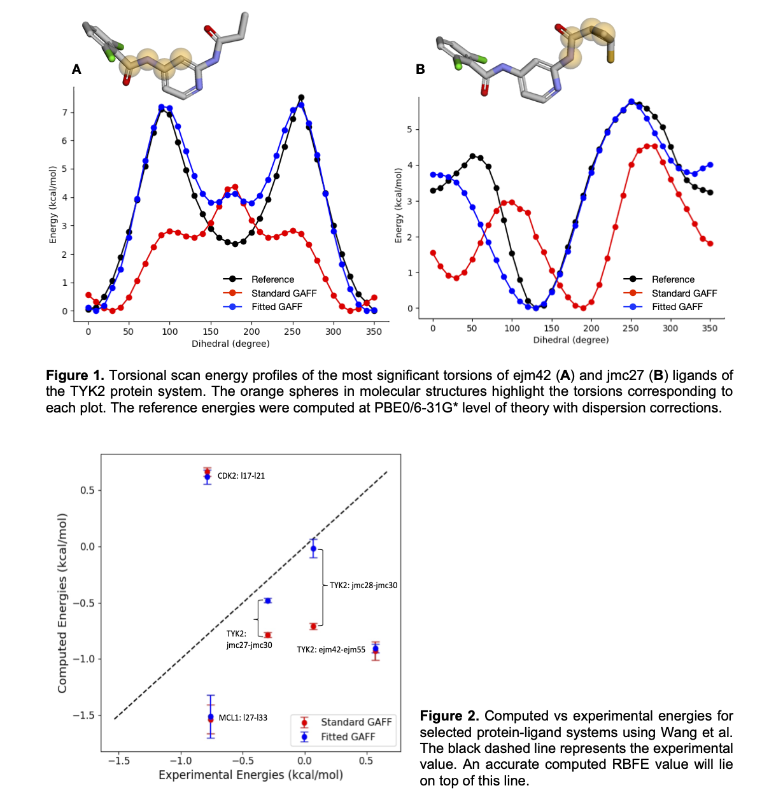

.. include:: ../affdo_docs_common.rst

Accuracy and Performance
========================

The data presented in this section were initially obtained using a previous version of AFFDO and have been further extended using the latest version, |BOLD_AFFDO_VERSION|. See the details below.

**Note**: The code is continuously being improved. Please make sure to use the latest AFFDO version. 

We have validated the accuracy of AFFDO using a protein-ligand dataset reported by Wang et al. [1]. In this dataset, the authors 
report the experimental relative binding free energies (RBFE) values for a series of protein-ligand systems. For the validation
study, a subset of these systems was selected, and RBFE simulations were carried out using the Amber Drug Discovery Boost package [2].
The standard GAFF (GAFF 2.11) force field was used for ligands, the ff14SB parameter set was used for proteins, and the TIP4P model was used for water.
The computed RBFE values using GAFF were compared against the experimental values; protein-ligand systems that displayed >1.0 kcal/mol error 
(the chemical accuracy threshold) were identified to test and validate AFFDO. Each ligand was used as input to the workflow, and force fields with optimized 
dihedral parameters were obtained for each ligand. The time taken for the full reparameterization process varied from 3 to 48 hours, depending 
on the system size, atom types, and hardware being used. 

In **Figure 1**, we present the torsional scan energy profiles for the most significant torsions 
of TYK2 ejm42 (**A**) and jmc27 (**B**). The GAFF2 energy profile (Standard GAFF) of the former mostly differs from the reference profile by barrier height. 
In contrast, the latter not only differs in barrier height, but also in phase. Using the AFFDO platform, both the phase and barrier height can be fitted, 
resulting in much tighter fits to the reference profiles (Fitted GAFF). After reparameterization, fitted force field parameters were used to recompute RBFE 
values for protein-ligand pairs. As depicted in **Figure 2**, the reparameterized GAFF force field improves the computed RBFE for all systems. For certain systems 
(e.g., TYK2 jmc28-jmc30, jmc27-jmc30), this improvement is more prominent than in others.

We have extended these validations using our latest version |BOLD_AFFDO_VERSION| in our manuscript [3], where we benchmark AFFDO against a wider range of drug-like molecules with complex torsions. In this study, both dihedral barrier heights and 1-4 scaling factors were optimized simultaneously. The results further demonstrate that AFFDO can significantly improve GAFF torsion parameters, leading to more accurate free energy predictions across different chemical environments.

Highlights from this new study include:

* **Torsion-scan accuracy:** For the TYK2 series, customized GAFF2 reduces MAE/RMSE from 1.56/1.92 kcal/mol to 0.20/0.24 kcal/mol relative to DFT scans; for the MCL1 series, errors drop from 0.81/1.08 to 0.51/0.69 kcal/mol, with Pearson and Spearman correlations ≥0.94 across both sets.
* **RBFE improvements:** AFFDO lowers the MAE in roughly 80% of the TYK2 and MCL1 transformations; inside this positively impacted subset the average drop is ~0.4 kcal/mol for TYK2 and ~0.8 kcal/mol for MCL1, with the largest gain reaching 2.45 kcal/mol. When considering all transformations, the net MAE reduction drops to half.
* **Sampling robustness:** Sampling robustness: Reparameterized torsions reduce RBFE uncertainty and improve sampling consistency, leading to more stable MD ensembles and more reliable alchemical free-energy calculations.
* **Workflow throughput:** Representative fragments (e.g., TYK2 jmc28_F1, MCL1 L35_F1) complete in roughly 1–7 hours on a 36-core/4×GPU cloud node, with QC centroid optimizations and torsional scans dominating wall time.

These findings, along with full torsional profiles, benchmarking workflows, and extended RBFE analyses, are presented comprehensively in our manuscript and its accompanying supporting information [3].

Extended Benchmark: Default AFFDO Settings
-------------------------------------------

In addition to the manuscript results above, we have benchmarked the current default AFFDO configuration on an extended subset of the Wang et al. [1] dataset. In this benchmark, only dihedral barrier heights are optimized (without scaling factor adjustments). This represents the out-of-the-box AFFDO experience for users running with default settings.

DFT Benchmark (58 systems)
^^^^^^^^^^^^^^^^^^^^^^^^^^^

The table below summarizes the torsion-scan accuracy using DFT constrained-optimization as the reference level. All energies are in kcal/mol; uncertainties represent 95% confidence intervals.

.. list-table:: Torsion-Scan Benchmark: Standard GAFF2 vs. AFFDO GAFF2 (DFT reference)
   :header-rows: 1
   :widths: 12 10 10 14 14 14 14 12

   * - Family
     - Systems
     - Torsions
     - GAFF2 RMSE
     - AFFDO RMSE
     - GAFF2 MAE
     - AFFDO MAE
     - Pearson
   * - MCL1
     - 42
     - 215
     - 1.12 ± 0.11
     - 0.52 ± 0.06
     - 0.89 ± 0.09
     - 0.39 ± 0.04
     - 0.90 → 0.96
   * - TYK2
     - 16
     - 90
     - 2.04 ± 0.27
     - 0.62 ± 0.12
     - 1.66 ± 0.24
     - 0.45 ± 0.09
     - 0.81 → 0.98
   * - **Overall**
     - **58**
     - **305**
     - **1.39 ± 0.12**
     - **0.55 ± 0.05**
     - **1.12 ± 0.10**
     - **0.41 ± 0.04**
     - **0.87 → 0.96**

Across 58 systems and 305 torsions, AFFDO reduces the overall RMSE by 60% (from 1.39 to 0.55 kcal/mol) and the MAE by 63% (from 1.12 to 0.41 kcal/mol), while improving the Pearson correlation from 0.87 to 0.96. These improvements are consistent across both the MCL1 and TYK2 protein families.

Multi-Reference Comparison (58 systems × 3 reference levels)
^^^^^^^^^^^^^^^^^^^^^^^^^^^^^^^^^^^^^^^^^^^^^^^^^^^^^^^^^^^^^

AFFDO supports multiple reference levels for torsion energy profiles. To guide users in selecting the appropriate reference level, we benchmarked the same 58 systems (16 TYK2, 42 MCL1) at three theory levels:

* **XTB**: GFN2-XTB torsional scan (fast, semi-empirical)
* **DFT-SP**: DFT single-point on XTB geometries (B3LYP/6-31G*)
* **DFT**: Full DFT constrained optimization (B3LYP/6-31G*)

All energies are in kcal/mol. Uncertainties are 95% confidence intervals. When AFFDO does not improve a torsion, GAFF2 parameters are retained.

.. raw:: html

   <table style="border-collapse: collapse; text-align: center; margin: 20px 0;">
   <thead>
   <tr style="border-bottom: 2px solid #333;">
     <th rowspan="2" style="text-align: left; padding: 8px; border-bottom: 2px solid #333;"><b>Metric</b></th>
     <th colspan="2" style="padding: 8px; border-bottom: 1px solid #999;"><b>TYK2</b> (16 sys, neutral)</th>
     <th colspan="2" style="padding: 8px; border-bottom: 1px solid #999;"><b>MCL1</b> (42 sys, q = −1)</th>
   </tr>
   <tr style="border-bottom: 2px solid #333;">
     <th style="padding: 6px;">GAFF2</th><th style="padding: 6px;">AFFDO</th>
     <th style="padding: 6px;">GAFF2</th><th style="padding: 6px;">AFFDO</th>
   </tr>
   </thead>
   <tbody>
   <tr style="background: #f0f0f0;"><td colspan="5" style="text-align: left; padding: 6px;"><b>XTB reference</b> — torsions improved: TYK2 74/90 (82%), MCL1 206/216 (95%)</td></tr>
   <tr><td style="text-align: left; padding: 6px;">MAE (kcal/mol)</td><td>1.61 ± 0.27</td><td>0.15 ± 0.04</td><td>1.37 ± 0.10</td><td>0.30 ± 0.03</td></tr>
   <tr><td style="text-align: left; padding: 6px;">RMSE (kcal/mol)</td><td>2.00 ± 0.31</td><td>0.21 ± 0.07</td><td>1.76 ± 0.13</td><td>0.40 ± 0.04</td></tr>
   <tr><td style="text-align: left; padding: 6px;">Pearson (<i>r</i>)</td><td>0.79</td><td>0.99</td><td>0.86</td><td>0.96</td></tr>
   <tr><td style="text-align: left; padding: 6px;">Spearman (<i>ρ</i>)</td><td>0.75</td><td>0.98</td><td>0.86</td><td>0.95</td></tr>

   <tr style="background: #f0f0f0;"><td colspan="5" style="text-align: left; padding: 6px;"><b>DFT-SP reference</b> — torsions improved: TYK2 75/90 (83%), MCL1 211/216 (98%)</td></tr>
   <tr><td style="text-align: left; padding: 6px;">MAE (kcal/mol)</td><td>1.68 ± 0.22</td><td>0.28 ± 0.06</td><td>1.05 ± 0.08</td><td>0.34 ± 0.03</td></tr>
   <tr><td style="text-align: left; padding: 6px;">RMSE (kcal/mol)</td><td>2.09 ± 0.26</td><td>0.39 ± 0.09</td><td>1.32 ± 0.09</td><td>0.47 ± 0.05</td></tr>
   <tr><td style="text-align: left; padding: 6px;">Pearson (<i>r</i>)</td><td>0.82</td><td>0.99</td><td>0.88</td><td>0.97</td></tr>
   <tr><td style="text-align: left; padding: 6px;">Spearman (<i>ρ</i>)</td><td>0.77</td><td>0.98</td><td>0.88</td><td>0.95</td></tr>

   <tr style="background: #f0f0f0;"><td colspan="5" style="text-align: left; padding: 6px;"><b>DFT reference</b> — torsions improved: TYK2 73/90 (81%), MCL1 169/215 (79%)</td></tr>
   <tr><td style="text-align: left; padding: 6px;">MAE (kcal/mol)</td><td>1.66 ± 0.24</td><td>0.45 ± 0.09</td><td>0.89 ± 0.09</td><td>0.39 ± 0.04</td></tr>
   <tr><td style="text-align: left; padding: 6px;">RMSE (kcal/mol)</td><td>2.04 ± 0.27</td><td>0.62 ± 0.12</td><td>1.12 ± 0.11</td><td>0.52 ± 0.06</td></tr>
   <tr><td style="text-align: left; padding: 6px;">Pearson (<i>r</i>)</td><td>0.81</td><td>0.98</td><td>0.90</td><td>0.96</td></tr>
   <tr><td style="text-align: left; padding: 6px;">Spearman (<i>ρ</i>)</td><td>0.75</td><td>0.95</td><td>0.89</td><td>0.94</td></tr>
   </tbody>
   </table>

Key findings from the multi-reference comparison:

* **All three reference levels produce significant improvements** over standard GAFF2, with RMSE reductions of 60–90% and Pearson correlations reaching 0.95–0.99.

* **DFT-SP achieves the highest success rate** (83% for TYK2, 98% for MCL1), combining DFT-quality energies with XTB geometries at single-point cost. This is the recommended default reference level for most applications.

* **XTB is competitive for both neutral and charged molecules**, achieving the lowest absolute RMSE for TYK2 (0.21 kcal/mol) and MCL1 (0.40 kcal/mol). XTB torsional scan profiles are smooth and well-suited for dihedral fitting.

* **DFT constrained-optimization produces the most physically accurate profiles**, but is the hardest to fit: only 79% of MCL1 torsions improve (vs 95–98% for XTB/DFT-SP). Full geometry relaxation introduces complex energy landscape features that single-barrier fitting cannot fully capture.

.. list-table:: Reference Level Recommendations
   :header-rows: 1
   :widths: 20 20 15 45

   * - Use Case
     - Reference Level
     - Speed
     - Notes
   * - Production (default)
     - **DFT-SP**
     - Medium
     - Best success rate, close to DFT quality
   * - Fast screening
     - **XTB**
     - Fast
     - Competitive RMSE, 82–95% success
   * - Highest fidelity
     - **DFT**
     - Slow
     - Most accurate profiles, but harder to fit (79–81%)

This benchmark is being extended to additional Wang et al. [1] systems and will be updated as new results become available.

**References**

[1] Wang, L., Wu, Y., Deng, Y., et al. (2015). Accurate and reliable prediction of relative ligand binding
potency in prospective drug discovery by way of a modern free-energy calculation protocol and force
field. Journal of the American Chemical Society, 137(7), 2695-2703.

[2] Ganguly, A., Tsai, H. C., Fernández-Pendás, M., Lee, T. S., Giese, T. J., & York, D. M. (2022). AMBER
Drug Discovery Boost Tools: Automated Workflow for Production Free-Energy Simulation Setup and Analysis (ProFESSA). 
Journal of Chemical Information and Modeling, 62(23), 6069-6083.

[3] Blanco-Gonzalez, A., Betancourt, W., Snyder, R., Zhang, S., Giese, T. J., Piskulich, Z. A., Goetz, A. W., Merz, K. M. Jr., York, D. M., Aktulga, H. M., Manathunga, M. (2024). 
Automated Force Field Developer and Optimizer Platform: Torsion Reparameterization. ChemRxiv. doi:10.26434/chemrxiv-2024-lcnx1.

*Last updated on* |UPDATE_DATE|.
