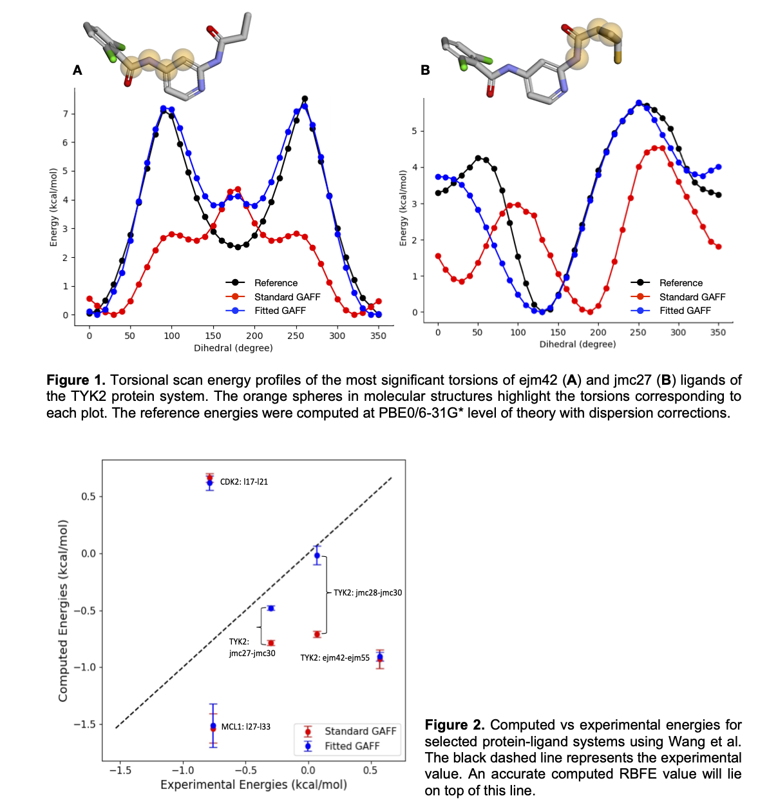

.. include:: ../affdo_docs_common.rst

Accuracy and Performance
========================

This page presents four benchmark phases, each building on the last:

1. **Validation Overview** — The principle of torsion fitting and its downstream effect on RBFE, illustrated with representative examples from Wang et al. [1].
2. **Published Benchmark** — The validation reported in Blanco-Gonzalez et al. [3], in which barrier heights **and** 1-4 scaling factors were optimized together.
3. **Default Benchmark** — The reference results for the current release: 175 systems across seven protein families using DFT reference profiles, AM1-BCC charges, and barrier-height fitting only.
4. **Methodology Studies** — Controlled comparisons on MCL1 and TYK2 addressing reference level, charge model, geometry fidelity, and RESP geometry source.

The primary metric throughout is **torsion-profile agreement** — how well AFFDO-fitted MM energy profiles reproduce QM reference scans. RBFE improvements are reported as complementary downstream validation where available.

**Note**: The code is continuously being improved. Please make sure to use the latest AFFDO version.

Validation Overview
-------------------

AFFDO improves molecular mechanics force fields by fitting torsion parameters to reproduce quantum-mechanical (QM) reference energy profiles. The examples below, taken from the Wang et al. [1] protein-ligand dataset, illustrate the approach and its effect.

In **Figure 1**, torsional scan energy profiles are shown for representative torsions of TYK2 ejm42 (**A**) and jmc27 (**B**). The standard GAFF2 profile of the former mostly differs from the reference by barrier height, while the latter differs in both barrier height and phase. Using AFFDO, both the phase and barrier height are fitted, resulting in much tighter agreement with the QM reference profiles (Fitted GAFF). Reparameterization times range from 3 to 48 hours depending on system size, atom types, and hardware.

These torsion-profile improvements also translate to better downstream predictions. As shown in **Figure 2**, RBFE values recomputed with the fitted parameters using the Amber Drug Discovery Boost package [2] (ff14SB for proteins, TIP4P for water) improve for all tested systems, with some pairs (e.g., TYK2 jmc28-jmc30, jmc27-jmc30) showing more prominent improvements than others. The systematic benchmarks that follow quantify these gains across larger datasets.

Published Benchmark
-------------------

Blanco-Gonzalez et al. [3] benchmarked |BOLD_AFFDO_VERSION| against a broad range of drug-like molecules with complex torsions, using DFT reference profiles and AM1-BCC charges. In that study, dihedral barrier heights **and** 1-4 scaling factors (scee/scnb) were optimized simultaneously. This differs from the current default configuration, which optimizes torsion parameters only (see `Default Benchmark: Full Wang Dataset`_ below).

Key findings:

* **Torsion-scan accuracy:** For the TYK2 series, customized GAFF2 reduces MAE/RMSE from 1.56/1.92 kcal/mol to 0.20/0.24 kcal/mol relative to DFT scans; for the MCL1 series, errors drop from 0.81/1.08 to 0.51/0.69 kcal/mol, with Pearson and Spearman correlations ≥0.94 across both sets.
* **RBFE improvements:** As a complementary downstream validation, AFFDO lowers the MAE in roughly 80% of TYK2 and MCL1 transformations; the average drop is ~0.4 kcal/mol for TYK2 and ~0.8 kcal/mol for MCL1, with the largest gain reaching 2.45 kcal/mol.
* **Sampling robustness:** Reparameterized torsions reduce RBFE uncertainty and improve sampling consistency, leading to more stable MD ensembles and more reliable alchemical free-energy calculations.
* **Workflow throughput:** Representative fragments (e.g., TYK2 jmc28_F1, MCL1 L35_F1) complete in roughly 1–7 hours on a 36-core/4×GPU cloud node, with QC centroid optimizations and torsional scans dominating wall time.

Complete torsional profiles, benchmarking workflows, and extended RBFE analyses are presented in ref [3] and its Supporting Information.

Default Benchmark: Full Wang Dataset
-------------------------------------

This is the canonical accuracy benchmark for AFFDO's current default configuration: **DFT constrained-optimization** as the reference profile, **AM1-BCC** as the charge model, JAX-SciPy hybrid optimizer with atom-type torsion coupling, and **no 1-4 scaling-factor optimization**. It covers **175 systems and 789 torsions** across the seven Wang FEP+ protein families included in this study.

The published benchmark [3] described in the previous section used the same DFT and AM1-BCC combination but additionally optimized the 1-4 scaling factors (scee/scnb) together with the torsion barrier heights. The current defaults (v25.11) fit **barrier heights only**, as subsequent testing showed that scaling-factor optimization yields marginal accuracy gains at a substantial cost in optimizer complexity and reproducibility. The tables below therefore provide the appropriate reference values for evaluating AFFDO in its default configuration.

.. list-table:: Scope
   :header-rows: 1
   :widths: 30 70

   * - Aspect
     - Value
   * - Systems
     - 175 total (bace 36, cdk2 16, jnk1 21, mcl1 42, p38 34, thrombin 10, tyk2 16)
   * - Torsions
     - 789 total across all fitted fragments
   * - Reference level
     - DFT constrained-optimization (PBE0-D3BJ/6-31G\*; 6-31+G\* for anionic species)
   * - Charge model
     - AM1-BCC (default; per-family gains from ABCG2/RESP are documented in the `Charge Model Comparison`_ study below)
   * - Fitting scope
     - **Torsion barrier heights only** — 1-4 scaling factors held at GAFF2 defaults
   * - Torsion coupling
     - atom-type mode
   * - Optimizer
     - JAX-SciPy hybrid (JAX Pass 1-2 + SciPy L-BFGS-B Pass 3)
   * - Excluded
     - PTP1B (20/23 ligands contain Br at net charge = −1, blocked by QUICK's ECP-free basis inventory)

Overall Accuracy
^^^^^^^^^^^^^^^^^

.. raw:: html

   <table style="border-collapse: collapse; text-align: center; margin: 20px 0;">
   <thead>
   <tr style="border-bottom: 2px solid #333;">
     <th style="text-align: left; padding: 8px;"><b>Metric</b></th>
     <th style="padding: 8px;"><b>GAFF2</b></th>
     <th style="padding: 8px;"><b>AFFDO</b></th>
     <th style="padding: 8px;"><b>Change</b></th>
   </tr>
   </thead>
   <tbody>
   <tr><td style="text-align: left; padding: 6px;">RMSE (kcal/mol)</td><td>1.82 ± 0.06</td><td>0.39 ± 0.01</td><td>&minus;78.8%</td></tr>
   <tr><td style="text-align: left; padding: 6px;">MAE (kcal/mol)</td><td>1.40 ± 0.04</td><td>0.28 ± 0.01</td><td>&minus;79.7%</td></tr>
   <tr><td style="text-align: left; padding: 6px;">Pearson (<i>r</i>)</td><td>0.79</td><td>0.96</td><td>+22%</td></tr>
   <tr><td style="text-align: left; padding: 6px;">Spearman (<i>&rho;</i>)</td><td>0.76</td><td>0.94</td><td>+23%</td></tr>
   <tr style="border-bottom: 2px solid #333;"><td style="text-align: left; padding: 6px;">Max RMSD&#42; (&#8491;)</td><td>0.81 ± 0.02</td><td>0.89 ± 0.02</td><td>+9%</td></tr>
   </tbody>
   <tfoot>
   <tr><td colspan="4" style="text-align: left; padding: 6px; font-size: 0.9em;">Uncertainties are &plusmn;SEM across per-torsion values. Torsions where the AFFDO fit was rejected by the quality gate retain GAFF2 parameters and are counted at their GAFF2 values, matching the shipped topology. &#42; <b>Max RMSD is a deliberately worst-case metric</b> &mdash; the <i>maximum</i> deviation across all scan points of a torsion, not the typical one. See <a href="#geometry-fidelity">Geometry Fidelity</a> for the distribution behind this number and why the aggregate shift is dominated by a small tail.</td></tr>
   </tfoot>
   </table>

Across the full 789-torsion slate, AFFDO reduces RMSE by **78.8%** (1.82 → 0.39 kcal/mol) and MAE by **79.7%** (1.40 → 0.28 kcal/mol). Rank correlation to the DFT reference rises from 0.79 → 0.96 (Pearson) and 0.76 → 0.94 (Spearman), indicating substantial profile-shape recovery in addition to the amplitude fit.

Worst-case geometry shifts modestly: Max RMSD moves from 0.81 to 0.89 Å (+9%). See `Geometry Fidelity`_ for what this metric measures and the regularization that bounds it.

Results by Protein Family
^^^^^^^^^^^^^^^^^^^^^^^^^^

Each cell reads **GAFF2 → AFFDO**. Energies in kcal/mol, Max RMSD in Å.

.. raw:: html

   <table style="border-collapse: collapse; text-align: center; margin: 20px 0; font-size: 0.92em;">
   <thead>
   <tr style="border-bottom: 2px solid #333;">
     <th style="text-align:left;padding:8px 10px;"><b>Family</b></th>
     <th style="padding:8px;"><b>Sys</b></th>
     <th style="padding:8px;"><b>Tors</b></th>
     <th style="padding:8px;"><b>RMSE</b></th>
     <th style="padding:8px;"><b>MAE</b></th>
     <th style="padding:8px;"><b>Pearson</b></th>
     <th style="padding:8px;"><b>Max RMSD</b>&#42;</th>
   </tr>
   </thead>
   <tbody>
   <tr><td style="text-align:left;padding:6px 10px;">bace</td><td style="padding:6px 8px;">36</td><td style="padding:6px 8px;">90</td><td style="padding:6px 8px;">0.59 → <b>0.17</b></td><td style="padding:6px 8px;">0.45 → 0.14</td><td style="padding:6px 8px;">0.81 → 0.98</td><td style="padding:6px 8px;">0.25 → 0.39</td></tr>
   <tr><td style="text-align:left;padding:6px 10px;">cdk2</td><td style="padding:6px 8px;">16</td><td style="padding:6px 8px;">68</td><td style="padding:6px 8px;">1.86 → <b>0.28</b></td><td style="padding:6px 8px;">1.32 → 0.20</td><td style="padding:6px 8px;">0.88 → 0.99</td><td style="padding:6px 8px;">1.09 → 1.10</td></tr>
   <tr><td style="text-align:left;padding:6px 10px;">jnk1</td><td style="padding:6px 8px;">21</td><td style="padding:6px 8px;">105</td><td style="padding:6px 8px;">2.81 → <b>0.55</b></td><td style="padding:6px 8px;">2.18 → 0.39</td><td style="padding:6px 8px;">0.60 → 0.95</td><td style="padding:6px 8px;">1.01 → 1.07</td></tr>
   <tr><td style="text-align:left;padding:6px 10px;">mcl1</td><td style="padding:6px 8px;">42</td><td style="padding:6px 8px;">215</td><td style="padding:6px 8px;">1.12 → <b>0.42</b></td><td style="padding:6px 8px;">0.89 → 0.30</td><td style="padding:6px 8px;">0.90 → 0.97</td><td style="padding:6px 8px;">0.58 → 0.67</td></tr>
   <tr><td style="text-align:left;padding:6px 10px;">p38</td><td style="padding:6px 8px;">34</td><td style="padding:6px 8px;">145</td><td style="padding:6px 8px;">2.02 → <b>0.44</b></td><td style="padding:6px 8px;">1.48 → 0.34</td><td style="padding:6px 8px;">0.68 → 0.89</td><td style="padding:6px 8px;">1.10 → <b>1.09</b></td></tr>
   <tr><td style="text-align:left;padding:6px 10px;">thrombin</td><td style="padding:6px 8px;">10</td><td style="padding:6px 8px;">76</td><td style="padding:6px 8px;">3.26 → <b>0.30</b></td><td style="padding:6px 8px;">2.49 → 0.22</td><td style="padding:6px 8px;">0.78 → 0.96</td><td style="padding:6px 8px;">0.95 → 1.12</td></tr>
   <tr><td style="text-align:left;padding:6px 10px;">tyk2</td><td style="padding:6px 8px;">16</td><td style="padding:6px 8px;">90</td><td style="padding:6px 8px;">2.04 → <b>0.41</b></td><td style="padding:6px 8px;">1.66 → 0.29</td><td style="padding:6px 8px;">0.81 → 0.99</td><td style="padding:6px 8px;">0.89 → 0.99</td></tr>
   </tbody>
   <tfoot>
   <tr style="border-top:2px solid #333;"><td colspan="7" style="text-align:left;padding:6px 10px;font-size:0.9em;">&#42; Worst-case metric &mdash; the maximum deviation across a torsion's scan points. p38 improves; the rest shift 0.01&ndash;0.17 &#8491;. Uncertainties omitted here for width; see <a href="#overall-accuracy">Overall Accuracy</a>.</td></tr>
   </tfoot>
   </table>

**Consistency across families.** RMSE reduction ranges from 63% (mcl1, where the GAFF2 baseline was already the lowest at 1.12 kcal/mol) to 91% (thrombin, where GAFF2 started at 3.26 kcal/mol). Absolute AFFDO RMSE settles in a tight 0.17–0.55 kcal/mol range across all seven families, indicating that the default configuration delivers converged results regardless of protein family or the initial GAFF2 baseline quality. Pearson correlations reach ≥0.95 in six of seven families — profile shape is recovered as well as amplitude.

Controlled comparisons of reference level, charge model, geometry regularization, and RESP geometry source are presented in the following section.

.. _methodology-studies:

Methodology Studies
-------------------

The studies below use the two protein families characterized in ref [3] — **MCL1** (42 systems, q = −1) and **TYK2** (16 systems, neutral) — as representative anionic and neutral test sets for examining individual aspects of the AFFDO workflow. Each study addresses a single methodological question underlying the current defaults reported in `Default Benchmark: Full Wang Dataset`_ above. All studies retain the barrier-height-only fitting scope, without scaling-factor optimization.

The metrics reported in these studies are self-referential, as each reference level is fitted to its own energy surface. A direct comparison of reference levels against the DFT ground truth is given in the `Cross-Reference Analysis`_ subsection.

Baseline Accuracy (58-System Subset)
^^^^^^^^^^^^^^^^^^^^^^^^^^^^^^^^^^^^^

The table below summarizes the overall GAFF2 vs AFFDO performance across the 58-system MCL1 + TYK2 methodology test set (305 torsions) at the DFT constrained-optimization reference level (PBE0-D3BJ/6-31G\*, with 6-31+G\* for anionic species) — the same reference used in the headline benchmark (Section 3). Metrics quantify agreement with QC torsional potential energy surfaces obtained from constrained dihedral scans evaluated on a 20° angular grid (i.e., scan-point energies) and should not be interpreted as RBFE predictive accuracy.

.. raw:: html

   <table style="border-collapse: collapse; text-align: center; margin: 20px 0;">
   <thead>
   <tr style="border-bottom: 2px solid #333;">
     <th style="text-align: left; padding: 8px;"><b>Metric</b></th>
     <th style="padding: 8px;"><b>GAFF2</b></th>
     <th style="padding: 8px;"><b>AFFDO</b></th>
     <th style="padding: 8px;"><b>Change</b></th>
   </tr>
   </thead>
   <tbody>
   <tr><td style="text-align: left; padding: 6px;">MAEa (kcal/mol)</td><td>1.12 ± 0.09</td><td>0.30 ± 0.03</td><td>&minus;73%</td></tr>
   <tr><td style="text-align: left; padding: 6px;">RMSEa (kcal/mol)</td><td>1.39 ± 0.11</td><td>0.41 ± 0.04</td><td>&minus;70%</td></tr>
   <tr><td style="text-align: left; padding: 6px;">Pearson (<i>r</i>)</td><td>0.87</td><td>0.98</td><td>+12%</td></tr>
   <tr><td style="text-align: left; padding: 6px;">Spearman (<i>ρ</i>)</td><td>0.85</td><td>0.96</td><td>+13%</td></tr>
   <tr style="border-bottom: 2px solid #333;"><td style="text-align: left; padding: 6px;">Max RMSDb (&#8491;)</td><td>0.68 ± 0.06</td><td>0.76 ± 0.07</td><td>+13%</td></tr>
   </tbody>
   <tfoot>
   <tr><td colspan="4" style="text-align: left; padding: 6px; font-size: 0.9em;">a Uncertainties are 95% confidence intervals. b <b>Worst-case metric</b> &mdash; the <i>maximum</i> RMSD between reference (DFT) and MM-optimized geometries across scan points per torsion, not the typical deviation. See <a href="#geometry-fidelity">Geometry Fidelity</a> for the distribution and the regularization that bounds it.</td></tr>
   </tfoot>
   </table>

Across 58 systems and 305 torsions, AFFDO reduces the overall RMSE by 70% (from 1.39 to 0.41 kcal/mol) and the MAE by 73% (from 1.12 to 0.30 kcal/mol), while improving the Pearson correlation from 0.87 to 0.98. The worst-case per-torsion Max RMSD rises modestly (0.68 → 0.76 Å, +13%) — a bounded, deliberate trade-off discussed in `Geometry Fidelity`_ below. These improvements are consistent across both the MCL1 (42 systems, charged) and TYK2 (16 systems, neutral) protein families.

Fitting Accuracy by Reference Level
^^^^^^^^^^^^^^^^^^^^^^^^^^^^^^^^^^^^^

AFFDO supports multiple reference levels for torsion energy profiles. To guide users in selecting the appropriate reference level, we benchmarked the same 58 systems (16 TYK2, 42 MCL1) at three theory levels:

* **XTB**: GFN2-XTB torsional scan (fast, semi-empirical)
* **DFT-SP**: DFT single-point on XTB geometries (PBE0-D3BJ/6-31G*, with 6-31+G* for anionic species)
* **DFT**: Full DFT constrained optimization (PBE0-D3BJ/6-31G*, with 6-31+G* for anionic species)

.. note::

   Each reference level fits a **different energy surface**, so the RMSE/MAE values below **cannot be compared across levels**. A lower RMSE at XTB reflects how smooth XTB profiles are, not better parameters. To rank the levels on parameter quality, see `Cross-Reference Analysis`_ — which reverses the apparent ordering.

All energies are in kcal/mol. Uncertainties are 95% confidence intervals. When AFFDO does not improve a torsion, GAFF2 parameters are retained.

.. raw:: html

   <table style="border-collapse: collapse; text-align: center; margin: 20px 0; border-spacing: 0;">
   <thead>
   <tr style="border-bottom: 2px solid #333;">
     <th rowspan="2" style="text-align: left; padding: 10px 14px; border-bottom: 2px solid #333;"><b>Metric</b></th>
     <th colspan="3" style="padding: 10px 12px; border-bottom: 1px solid #999; border-left: 2px solid #ccc;"><b>TYK2</b> (16 sys, neutral)</th>
     <th colspan="3" style="padding: 10px 12px; border-bottom: 1px solid #999; border-left: 2px solid #ccc;"><b>MCL1</b> (42 sys, q = −1)</th>
   </tr>
   <tr style="border-bottom: 2px solid #333;">
     <th style="padding: 8px 12px; border-left: 2px solid #ccc;">GAFF2</th><th style="padding: 8px 12px;">AFFDO</th><th style="padding: 8px 10px;">Δ</th>
     <th style="padding: 8px 12px; border-left: 2px solid #ccc;">GAFF2</th><th style="padding: 8px 12px;">AFFDO</th><th style="padding: 8px 10px;">Δ</th>
   </tr>
   </thead>
   <tbody>
   <tr style="background: #f0f0f0;"><td colspan="7" style="text-align: left; padding: 8px 14px;"><b>XTB reference</b></td></tr>
   <tr><td style="text-align: left; padding: 8px 14px;">MAE (kcal/mol)</td><td style="padding: 8px 12px; border-left: 2px solid #ccc;">1.61 ± 0.27</td><td style="padding: 8px 12px;">0.15 ± 0.04</td><td style="padding: 8px 10px;">−91%</td><td style="padding: 8px 12px; border-left: 2px solid #ccc;">1.37 ± 0.10</td><td style="padding: 8px 12px;">0.30 ± 0.03</td><td style="padding: 8px 10px;">−78%</td></tr>
   <tr><td style="text-align: left; padding: 8px 14px;">RMSE (kcal/mol)</td><td style="padding: 8px 12px; border-left: 2px solid #ccc;">2.00 ± 0.31</td><td style="padding: 8px 12px;">0.21 ± 0.07</td><td style="padding: 8px 10px;">−90%</td><td style="padding: 8px 12px; border-left: 2px solid #ccc;">1.76 ± 0.13</td><td style="padding: 8px 12px;">0.40 ± 0.04</td><td style="padding: 8px 10px;">−77%</td></tr>
   <tr><td style="text-align: left; padding: 8px 14px;">Pearson (<i>r</i>)</td><td style="padding: 8px 12px; border-left: 2px solid #ccc;">0.79</td><td style="padding: 8px 12px;">0.99</td><td style="padding: 8px 10px;">+25%</td><td style="padding: 8px 12px; border-left: 2px solid #ccc;">0.86</td><td style="padding: 8px 12px;">0.96</td><td style="padding: 8px 10px;">+12%</td></tr>
   <tr><td style="text-align: left; padding: 8px 14px;">Spearman (<i>ρ</i>)</td><td style="padding: 8px 12px; border-left: 2px solid #ccc;">0.75</td><td style="padding: 8px 12px;">0.98</td><td style="padding: 8px 10px;">+31%</td><td style="padding: 8px 12px; border-left: 2px solid #ccc;">0.86</td><td style="padding: 8px 12px;">0.95</td><td style="padding: 8px 10px;">+10%</td></tr>
   <tr><td style="text-align: left; padding: 8px 14px;">Max RMSD (&#8491;)</td><td style="padding: 8px 12px; border-left: 2px solid #ccc;">0.85 ± 0.11</td><td style="padding: 8px 12px;">0.92 ± 0.11</td><td style="padding: 8px 10px;">+8%</td><td style="padding: 8px 12px; border-left: 2px solid #ccc;">0.79 ± 0.08</td><td style="padding: 8px 12px;">0.77 ± 0.08</td><td style="padding: 8px 10px;">&#8722;3%</td></tr>

   <tr style="background: #f0f0f0;"><td colspan="7" style="text-align: left; padding: 8px 14px;"><b>DFT-SP reference</b></td></tr>
   <tr><td style="text-align: left; padding: 8px 14px;">MAE (kcal/mol)</td><td style="padding: 8px 12px; border-left: 2px solid #ccc;">1.68 ± 0.22</td><td style="padding: 8px 12px;">0.28 ± 0.06</td><td style="padding: 8px 10px;">−83%</td><td style="padding: 8px 12px; border-left: 2px solid #ccc;">1.05 ± 0.08</td><td style="padding: 8px 12px;">0.34 ± 0.03</td><td style="padding: 8px 10px;">−68%</td></tr>
   <tr><td style="text-align: left; padding: 8px 14px;">RMSE (kcal/mol)</td><td style="padding: 8px 12px; border-left: 2px solid #ccc;">2.09 ± 0.26</td><td style="padding: 8px 12px;">0.39 ± 0.09</td><td style="padding: 8px 10px;">−81%</td><td style="padding: 8px 12px; border-left: 2px solid #ccc;">1.32 ± 0.09</td><td style="padding: 8px 12px;">0.47 ± 0.05</td><td style="padding: 8px 10px;">−64%</td></tr>
   <tr><td style="text-align: left; padding: 8px 14px;">Pearson (<i>r</i>)</td><td style="padding: 8px 12px; border-left: 2px solid #ccc;">0.82</td><td style="padding: 8px 12px;">0.99</td><td style="padding: 8px 10px;">+21%</td><td style="padding: 8px 12px; border-left: 2px solid #ccc;">0.88</td><td style="padding: 8px 12px;">0.97</td><td style="padding: 8px 10px;">+10%</td></tr>
   <tr><td style="text-align: left; padding: 8px 14px;">Spearman (<i>ρ</i>)</td><td style="padding: 8px 12px; border-left: 2px solid #ccc;">0.77</td><td style="padding: 8px 12px;">0.98</td><td style="padding: 8px 10px;">+27%</td><td style="padding: 8px 12px; border-left: 2px solid #ccc;">0.88</td><td style="padding: 8px 12px;">0.95</td><td style="padding: 8px 10px;">+8%</td></tr>
   <tr><td style="text-align: left; padding: 8px 14px;">Max RMSD (&#8491;)</td><td style="padding: 8px 12px; border-left: 2px solid #ccc;">0.82 ± 0.11</td><td style="padding: 8px 12px;">0.93 ± 0.12</td><td style="padding: 8px 10px;">+13%</td><td style="padding: 8px 12px; border-left: 2px solid #ccc;">0.79 ± 0.08</td><td style="padding: 8px 12px;">0.84 ± 0.07</td><td style="padding: 8px 10px;">+6%</td></tr>

   <tr style="background: #f0f0f0;"><td colspan="7" style="text-align: left; padding: 8px 14px;"><b>DFT reference</b></td></tr>
   <tr><td style="text-align: left; padding: 8px 14px;">MAE (kcal/mol)</td><td style="padding: 8px 12px; border-left: 2px solid #ccc;">1.66 ± 0.24</td><td style="padding: 8px 12px;">0.29 ± 0.08</td><td style="padding: 8px 10px;">&minus;82%</td><td style="padding: 8px 12px; border-left: 2px solid #ccc;">0.89 ± 0.10</td><td style="padding: 8px 12px;">0.30 ± 0.02</td><td style="padding: 8px 10px;">&minus;66%</td></tr>
   <tr><td style="text-align: left; padding: 8px 14px;">RMSE (kcal/mol)</td><td style="padding: 8px 12px; border-left: 2px solid #ccc;">2.04 ± 0.27</td><td style="padding: 8px 12px;">0.41 ± 0.12</td><td style="padding: 8px 10px;">&minus;80%</td><td style="padding: 8px 12px; border-left: 2px solid #ccc;">1.12 ± 0.12</td><td style="padding: 8px 12px;">0.42 ± 0.04</td><td style="padding: 8px 10px;">&minus;63%</td></tr>
   <tr><td style="text-align: left; padding: 8px 14px;">Pearson (<i>r</i>)</td><td style="padding: 8px 12px; border-left: 2px solid #ccc;">0.81</td><td style="padding: 8px 12px;">0.99</td><td style="padding: 8px 10px;">+22%</td><td style="padding: 8px 12px; border-left: 2px solid #ccc;">0.90</td><td style="padding: 8px 12px;">0.97</td><td style="padding: 8px 10px;">+8%</td></tr>
   <tr><td style="text-align: left; padding: 8px 14px;">Spearman (<i>ρ</i>)</td><td style="padding: 8px 12px; border-left: 2px solid #ccc;">0.75</td><td style="padding: 8px 12px;">0.97</td><td style="padding: 8px 10px;">+29%</td><td style="padding: 8px 12px; border-left: 2px solid #ccc;">0.89</td><td style="padding: 8px 12px;">0.95</td><td style="padding: 8px 10px;">+7%</td></tr>
   <tr><td style="text-align: left; padding: 8px 14px;">Max RMSD&#42; (&#8491;)</td><td style="padding: 8px 12px; border-left: 2px solid #ccc;">0.89 ± 0.12</td><td style="padding: 8px 12px;">0.99 ± 0.12</td><td style="padding: 8px 10px;">+11%</td><td style="padding: 8px 12px; border-left: 2px solid #ccc;">0.58 ± 0.06</td><td style="padding: 8px 12px;">0.67 ± 0.08</td><td style="padding: 8px 10px;">+14%</td></tr>
   </tbody>
   <tfoot>
   <tr><td colspan="7" style="text-align: left; padding: 6px 14px; font-size: 0.9em;">&#42; Max RMSD is a worst-case statistic (maximum across scan points per torsion). See <a href="#geometry-fidelity">Geometry Fidelity</a>.</td></tr>
   </tfoot>
   </table>

All three reference levels produce significant improvements over standard GAFF2, with RMSE reductions of 63–90% and AFFDO Pearson correlations of 0.97–0.99. Worst-case geometry stays bounded across all three: Max RMSD shifts by roughly ±0.1 Å relative to the GAFF2 baseline post-fit — see `Geometry Fidelity`_ for what this metric measures. Fit rates — the fraction of torsions where AFFDO beat the GAFF2 baseline — are 82% (TYK2) / 95% (MCL1) for XTB, 83% / 98% for DFT-SP, and 82% / 81% for DFT.

DFT-SP combines DFT-quality energies with XTB geometries at single-point cost, producing smooth profiles that the optimizer fits reliably. XTB shows the lowest RMSE in this table for both neutral and charged molecules — but that is a *self-referential* result: XTB profiles are the smoothest, so they are the easiest to fit, which says nothing about how close the resulting parameters are to reality. `Cross-Reference Analysis`_ below resolves this. DFT constrained-optimization produces the most physically accurate profiles and is correspondingly the hardest to fit, because full geometry relaxation introduces landscape features a truncated Fourier series cannot fully capture.

Geometry Fidelity
^^^^^^^^^^^^^^^^^^

AFFDO uses a two-level optimization strategy to balance energy accuracy with geometric fidelity. In the inner loop, torsion parameters are refined using single-point (SP) energy evaluations on fixed geometries — this is fast and allows efficient gradient-based exploration of parameter space. Periodically, outer geometry-refresh cycles re-minimize MM geometries with the updated parameters and recompute energy profiles, ensuring that the torsion parameters remain consistent with relaxed molecular structures.

This represents a deliberate trade-off between computational cost and geometric accuracy. The protocol reported in ref [3] performed a constrained optimization after every inner iteration, which held the geometry close to the reference at considerably greater expense. The current default restricts constrained optimization to the outer cycles, substantially reducing cost while producing a small shift in worst-case geometry: at the DFT reference level, Max RMSD increases from 0.68 to 0.76 Å (+13%), while the energy RMSE decreases by 70%.

Max RMSD is the most conservative metric reported, since it records the *maximum* deviation across a torsion's scan points; a single high-deviation point therefore determines the value for the entire torsion. Averaged over all scan points, the same fits give 0.33 → 0.39 Å. Among the torsions that AFFDO refits, the median Max RMSD shifts by approximately 0.04 Å, and roughly one third improve.

To further control this trade-off, AFFDO employs a composite scoring function during outer-cycle selection:

.. math::

   S = \text{RMSD}_{\text{energy}} + \lambda \cdot \overline{\text{RMSD}}_{\text{geom}}

where :math:`\lambda` (default 0.5) weights geometric fidelity against energy accuracy. This provides a light geometry bias when selecting among candidate parameter sets from different optimization cycles, without significantly affecting energy quality.

A λ sweep on the 16 TYK2 ligands (73 torsions) at the XTB reference level establishes why 0.5 is the default:

.. raw:: html

   <table style="border-collapse: collapse; text-align: center; margin: 20px 0;">
   <thead>
   <tr style="border-bottom: 2px solid #333;">
     <th style="text-align: left; padding: 8px;"><b>Metric</b></th>
     <th style="padding: 8px;"><b>&lambda; = 0</b></th>
     <th style="padding: 8px;"><b>&lambda; = 0.5</b> (default)</th>
     <th style="padding: 8px;"><b>&lambda; = 1.0</b></th>
     <th style="padding: 8px;"><b>&lambda; = 2.0</b></th>
   </tr>
   </thead>
   <tbody>
   <tr><td style="text-align: left; padding: 6px;">Mean energy RMSD (kcal/mol)</td><td><b>0.129</b></td><td>0.132</td><td>0.140</td><td>0.151</td></tr>
   <tr><td style="text-align: left; padding: 6px;">Mean geom RMSD (&#8491;)</td><td>0.418</td><td>0.375</td><td>0.370</td><td><b>0.363</b></td></tr>
   <tr><td style="text-align: left; padding: 6px;">Mean Max RMSD (&#8491;)</td><td>1.042</td><td><b>1.012</b></td><td>1.016</td><td>1.042</td></tr>
   <tr style="border-bottom: 2px solid #333;"><td style="text-align: left; padding: 6px;">Mean norm_RMSE</td><td><b>0.045</b></td><td>0.046</td><td>0.048</td><td>0.052</td></tr>
   </tbody>
   </table>

With no regularization (:math:`\lambda = 0`), the optimizer achieves the lowest energy RMSD but mean geometry RMSD rises to 0.418 Å. The default (:math:`\lambda = 0.5`) brings it to 0.375 Å at negligible energy cost.

Increasing λ beyond this point yields diminishing returns: :math:`\lambda = 2.0` improves the mean geometry by only 0.012 Å while degrading the energy RMSD by 14%. It also provides no benefit in the worst case — the mean Max RMSD is *minimized at the default value* (1.012 Å) and increases in both directions, reaching 1.042 Å at :math:`\lambda = 0` and the same value at :math:`\lambda = 2.0`. Because λ weights the *mean* geometric deviation during outer-cycle selection, it exerts limited influence on worst-case values. A value of 0.5 lies at the minimum of this curve and is therefore adopted as the default.

.. note::

   Two geometry RMSD metrics appear in the AFFDO results:

   - **Max RMSD** (per-reference-level tables above): the maximum RMSD between reference and MM-optimized geometries across all scan points for a given torsion, evaluated once with the final fitted parameters. This is a post-hoc quality metric.
   - **Mean geom RMSD** (lambda comparison table): the mean RMSD across all scan points, computed *during* fitting at each outer geometry-refresh cycle. This is the metric used by the composite score to select among candidate parameter sets from different optimization cycles.

.. _Cross-Reference Analysis:

Cross-Reference Analysis
^^^^^^^^^^^^^^^^^^^^^^^^^

The fitting accuracy table above reports how closely AFFDO reproduces the energy surface of each reference level, but it does not establish how close the resulting parameters are to the DFT ground truth. To address this, XTB and DFT-SP torsion profiles were evaluated directly against DFT constrained-optimization profiles for the same 305 torsions.

.. raw:: html

   <table style="border-collapse: collapse; text-align: center; margin: 20px 0;">
   <thead>
   <tr style="border-bottom: 2px solid #333;">
     <th style="text-align: left; padding: 8px;"><b>Metric</b></th>
     <th style="padding: 8px;"><b>XTB vs DFT</b></th>
     <th style="padding: 8px;"><b>DFT-SP vs DFT</b></th>
   </tr>
   </thead>
   <tbody>
   <tr><td style="text-align: left; padding: 6px;">RMSE (kcal/mol)</td><td>1.39 ± 0.09</td><td>0.97 ± 0.13</td></tr>
   <tr><td style="text-align: left; padding: 6px;">MAE (kcal/mol)</td><td>1.14 ± 0.08</td><td>0.74 ± 0.10</td></tr>
   <tr style="border-bottom: 2px solid #333;"><td style="text-align: left; padding: 6px;">Pearson (<i>r</i>)</td><td>0.84</td><td>0.85</td></tr>
   </tbody>
   </table>

DFT-SP profiles are 30% closer to DFT ground truth than XTB profiles (RMSE 0.97 vs 1.39 kcal/mol). This gap propagates through fitting: even though XTB fitting achieves a lower self-referential RMSE (0.34 vs 0.45), the XTB reference surface itself is further from DFT, so the final fitted parameters end up less accurate.

The table below combines fitting quality, reference quality, and net accuracy:

.. raw:: html

   <table style="border-collapse: collapse; text-align: center; margin: 20px 0;">
   <thead>
   <tr style="border-bottom: 2px solid #333;">
     <th style="text-align: left; padding: 8px;"><b>Reference</b></th>
     <th style="padding: 8px;"><b>Fitting quality</b> (self-ref RMSE)</th>
     <th style="padding: 8px;"><b>Reference quality</b> (vs DFT RMSE)</th>
     <th style="padding: 8px;"><b>Net accuracy</b> (fitted vs DFT RMSE)</th>
   </tr>
   </thead>
   <tbody>
   <tr><td style="text-align: left; padding: 6px;">XTB</td><td>0.34</td><td>1.39</td><td>1.40</td></tr>
   <tr><td style="text-align: left; padding: 6px;">DFT-SP</td><td>0.45</td><td>0.98</td><td>1.08</td></tr>
   <tr style="border-bottom: 2px solid #333;"><td style="text-align: left; padding: 6px;">DFT</td><td>0.41</td><td>0.00</td><td>0.42</td></tr>
   </tbody>
   <tfoot>
   <tr><td colspan="4" style="text-align: left; padding: 6px; font-size: 0.9em;">All RMSE values in kcal/mol, pooled over TYK2 + MCL1. Fitting quality is the production-behavior self-referential RMSE (GAFF2 retained for unfitted torsions); reference and net accuracy are per-torsion profile comparisons over 308 torsions from 58 Wang et al. systems.</td></tr>
   </tfoot>
   </table>

DFT constrained-optimization yields the highest accuracy (net RMSE 0.42 kcal/mol) but requires the longest computation time. Because DFT is its own reference, its fitting quality and net accuracy coincide — there is no reference error to propagate. DFT-SP is a cost-effective alternative, achieving 23% lower net error than XTB (1.08 vs 1.40 kcal/mol) at a fraction of the cost of full DFT. XTB reproduces its own surface most closely (0.34), but that surface deviates furthest from DFT, so its fitted parameters are the least accurate with respect to the ground truth. Fitting quality alone is therefore not a reliable indicator of parameter quality.

.. list-table:: Reference Level Summary
   :header-rows: 1
   :widths: 20 15 15 50

   * - Reference Level
     - Speed
     - Net RMSE
     - Notes
   * - **DFT**
     - Slow
     - 0.42
     - Highest accuracy; longest computation time
   * - **DFT-SP**
     - Medium
     - 1.08
     - Good alternative; best improvement rate (83–98%)
   * - **XTB**
     - Fast
     - 1.40
     - Rapid screening; limited by reference quality

Charge Model Comparison
^^^^^^^^^^^^^^^^^^^^^^^

Torsion parameters and partial charges are deeply coupled in molecular mechanics force fields.
The torsion Fourier series must compensate for errors in 1-4 electrostatic interactions, so the
quality of partial charges directly affects torsion fitting accuracy. GAFF2's generic torsion
parameters were derived assuming RESP-quality electrostatics; pairing them with approximate charges
therefore introduces a coupling error that the fitted torsions must absorb alongside genuine
torsional effects.

We benchmarked three charge models on all 58 DFT reference systems using identical optimizer settings:

- **AM1-BCC**: semi-empirical AM1 charges with Bond Charge Corrections — fast, default in AmberTools
- **ABCG2**: BCC parameters re-fitted for GAFF2 against neutral solvation free energies — fast, improved solvation accuracy on neutral organic solutes
- **RESP**: charges fitted to the QM electrostatic potential (HF/6-31G*, with HF/6-31+G* for anions) — requires a DFT-level QM calculation

All metrics below are averaged only over torsions where AFFDO improved on the
GAFF2 baseline (the per-section "torsions fitted" counts), with the GAFF2 and
AFFDO columns computed over that same row set. This differs from the
production-behavior RMSE in the per-reference-level table above, which retains
GAFF2 for unfitted torsions. All three arms were fitted with the current
JAX-SciPy optimizer, so the comparison isolates the charge model.

.. raw:: html

   <table style="border-collapse: collapse; text-align: center; margin: 20px 0; border-spacing: 0;">
   <thead>
   <tr style="border-bottom: 2px solid #333;">
     <th rowspan="2" style="text-align: left; padding: 10px 14px; border-bottom: 2px solid #333;"><b>Metric</b></th>
     <th colspan="3" style="padding: 10px 12px; border-bottom: 1px solid #999; border-left: 2px solid #ccc;"><b>TYK2</b> (16 sys, neutral)</th>
     <th colspan="3" style="padding: 10px 12px; border-bottom: 1px solid #999; border-left: 2px solid #ccc;"><b>MCL1</b> (42 sys, q = &minus;1)</th>
   </tr>
   <tr style="border-bottom: 2px solid #333;">
     <th style="padding: 8px 12px; border-left: 2px solid #ccc;">GAFF2</th><th style="padding: 8px 12px;">AFFDO</th><th style="padding: 8px 10px;">&Delta;</th>
     <th style="padding: 8px 12px; border-left: 2px solid #ccc;">GAFF2</th><th style="padding: 8px 12px;">AFFDO</th><th style="padding: 8px 10px;">&Delta;</th>
   </tr>
   </thead>
   <tbody>
   <tr style="background: #f0f0f0;"><td colspan="7" style="text-align: left; padding: 8px 14px;"><b>AM1-BCC charges</b> &mdash; torsions fitted: TYK2 74/90 (82%), MCL1 174/215 (81%)</td></tr>
   <tr><td style="text-align: left; padding: 8px 14px;">MAE (kcal/mol)</td><td style="padding: 8px 12px; border-left: 2px solid #ccc;">1.83 ± 0.27</td><td style="padding: 8px 12px;">0.17 ± 0.06</td><td style="padding: 8px 10px;">&minus;91%</td><td style="padding: 8px 12px; border-left: 2px solid #ccc;">1.05 ± 0.10</td><td style="padding: 8px 12px;">0.32 ± 0.03</td><td style="padding: 8px 10px;">&minus;70%</td></tr>
   <tr><td style="text-align: left; padding: 8px 14px;">RMSE (kcal/mol)</td><td style="padding: 8px 12px; border-left: 2px solid #ccc;">2.24 ± 0.31</td><td style="padding: 8px 12px;">0.25 ± 0.11</td><td style="padding: 8px 10px;">&minus;89%</td><td style="padding: 8px 12px; border-left: 2px solid #ccc;">1.30 ± 0.12</td><td style="padding: 8px 12px;">0.44 ± 0.04</td><td style="padding: 8px 10px;">&minus;66%</td></tr>
   <tr><td style="text-align: left; padding: 8px 14px;">Pearson (<i>r</i>)</td><td style="padding: 8px 12px; border-left: 2px solid #ccc;">0.78</td><td style="padding: 8px 12px;">0.99</td><td style="padding: 8px 10px;">+28%</td><td style="padding: 8px 12px; border-left: 2px solid #ccc;">0.88</td><td style="padding: 8px 12px;">0.97</td><td style="padding: 8px 10px;">+10%</td></tr>
   <tr><td style="text-align: left; padding: 8px 14px;">Spearman (<i>ρ</i>)</td><td style="padding: 8px 12px; border-left: 2px solid #ccc;">0.71</td><td style="padding: 8px 12px;">0.97</td><td style="padding: 8px 10px;">+38%</td><td style="padding: 8px 12px; border-left: 2px solid #ccc;">0.88</td><td style="padding: 8px 12px;">0.95</td><td style="padding: 8px 10px;">+8%</td></tr>

   <tr style="background: #f0f0f0;"><td colspan="7" style="text-align: left; padding: 8px 14px;"><b>ABCG2 charges</b> &mdash; torsions fitted: TYK2 90/90 (100%), MCL1 173/215 (80%)</td></tr>
   <tr><td style="text-align: left; padding: 8px 14px;">MAE (kcal/mol)</td><td style="padding: 8px 12px; border-left: 2px solid #ccc;">1.80 ± 0.27</td><td style="padding: 8px 12px;">0.14 ± 0.04</td><td style="padding: 8px 10px;">&minus;92%</td><td style="padding: 8px 12px; border-left: 2px solid #ccc;">1.07 ± 0.10</td><td style="padding: 8px 12px;">0.31 ± 0.03</td><td style="padding: 8px 10px;">&minus;71%</td></tr>
   <tr><td style="text-align: left; padding: 8px 14px;">RMSE (kcal/mol)</td><td style="padding: 8px 12px; border-left: 2px solid #ccc;">2.24 ± 0.32</td><td style="padding: 8px 12px;">0.21 ± 0.08</td><td style="padding: 8px 10px;">&minus;91%</td><td style="padding: 8px 12px; border-left: 2px solid #ccc;">1.33 ± 0.12</td><td style="padding: 8px 12px;">0.43 ± 0.04</td><td style="padding: 8px 10px;">&minus;68%</td></tr>
   <tr><td style="text-align: left; padding: 8px 14px;">Pearson (<i>r</i>)</td><td style="padding: 8px 12px; border-left: 2px solid #ccc;">0.81</td><td style="padding: 8px 12px;">0.99</td><td style="padding: 8px 10px;">+22%</td><td style="padding: 8px 12px; border-left: 2px solid #ccc;">0.88</td><td style="padding: 8px 12px;">0.97</td><td style="padding: 8px 10px;">+10%</td></tr>
   <tr><td style="text-align: left; padding: 8px 14px;">Spearman (<i>ρ</i>)</td><td style="padding: 8px 12px; border-left: 2px solid #ccc;">0.75</td><td style="padding: 8px 12px;">0.98</td><td style="padding: 8px 10px;">+30%</td><td style="padding: 8px 12px; border-left: 2px solid #ccc;">0.88</td><td style="padding: 8px 12px;">0.95</td><td style="padding: 8px 10px;">+8%</td></tr>

   <tr style="background: #f0f0f0;"><td colspan="7" style="text-align: left; padding: 8px 14px;"><b>RESP charges</b> &mdash; torsions fitted: TYK2 90/90 (100%), MCL1 202/215 (94%)</td></tr>
   <tr><td style="text-align: left; padding: 8px 14px;">MAE (kcal/mol)</td><td style="padding: 8px 12px; border-left: 2px solid #ccc;">1.95 ± 0.23</td><td style="padding: 8px 12px;">0.17 ± 0.04</td><td style="padding: 8px 10px;">&minus;91%</td><td style="padding: 8px 12px; border-left: 2px solid #ccc;">1.06 ± 0.11</td><td style="padding: 8px 12px;">0.26 ± 0.02</td><td style="padding: 8px 10px;">&minus;76%</td></tr>
   <tr><td style="text-align: left; padding: 8px 14px;">RMSE (kcal/mol)</td><td style="padding: 8px 12px; border-left: 2px solid #ccc;">2.38 ± 0.26</td><td style="padding: 8px 12px;">0.24 ± 0.07</td><td style="padding: 8px 10px;">&minus;90%</td><td style="padding: 8px 12px; border-left: 2px solid #ccc;">1.35 ± 0.13</td><td style="padding: 8px 12px;">0.35 ± 0.04</td><td style="padding: 8px 10px;">&minus;74%</td></tr>
   <tr><td style="text-align: left; padding: 8px 14px;">Pearson (<i>r</i>)</td><td style="padding: 8px 12px; border-left: 2px solid #ccc;">0.83</td><td style="padding: 8px 12px;">0.99</td><td style="padding: 8px 10px;">+20%</td><td style="padding: 8px 12px; border-left: 2px solid #ccc;">0.86</td><td style="padding: 8px 12px;">0.98</td><td style="padding: 8px 10px;">+14%</td></tr>
   <tr><td style="text-align: left; padding: 8px 14px;">Spearman (<i>ρ</i>)</td><td style="padding: 8px 12px; border-left: 2px solid #ccc;">0.75</td><td style="padding: 8px 12px;">0.97</td><td style="padding: 8px 10px;">+30%</td><td style="padding: 8px 12px; border-left: 2px solid #ccc;">0.86</td><td style="padding: 8px 12px;">0.96</td><td style="padding: 8px 10px;">+11%</td></tr>
   </tbody>
   </table>

Aggregating across both families: AM1-BCC fits 248/305 torsions (81%) with mean
post-fit RMSE 0.383 kcal/mol; ABCG2 fits 263/305 (86%) with 0.354; RESP fits
292/305 (96%) with **0.313**. The RMSE reduction over GAFF2 is 76%, 78%, and
**81%** respectively.

To make the comparison independent of the GAFF2 baseline, a direct pairwise
comparison of the absolute AFFDO RMSE — that is, the per-torsion RMSE after
fitting, irrespective of the starting point — is also reported for the 232
torsions fitted by all three charge models. The table additionally reports the
number of systems favoring each model across the full 58-system set (mean
improvement difference > 1%).

.. list-table:: Head-to-Head: per-torsion (232 common) and per-system (58 total)
   :header-rows: 1
   :widths: 22 26 26 26

   * - Matchup
     - Per-torsion winner
     - Per-system winner
     - Tie
   * - AM1-BCC vs ABCG2
     - **ABCG2 42%** (BCC 33%)
     - **ABCG2 34/58** (BCC 10)
     - 25% / 14 sys
   * - AM1-BCC vs RESP
     - **RESP 44%** (BCC 36%)
     - **RESP 38/58** (BCC 13)
     - 20% / 7 sys
   * - ABCG2 vs RESP
     - **RESP 41%** (ABCG2 40%)
     - **RESP 34/58** (ABCG2 18)
     - 24% / 6 sys

To translate these RMSE values into something more interpretable, the
distribution table below shows the fraction of fitted torsions that fall
below common quality thresholds:

.. list-table:: AFFDO RMSE Quality Distribution
   :header-rows: 1
   :widths: 25 18 18 18 21

   * - Charge Model
     - Torsions Fitted
     - < 0.25 kcal/mol
     - < 0.50 kcal/mol
     - < 1.00 kcal/mol
   * - AM1-BCC
     - 248
     - 46%
     - 78%
     - 95%
   * - ABCG2
     - 263
     - 48%
     - 80%
     - 95%
   * - **RESP**
     - **292**
     - **64%**
     - **82%**
     - **96%**

RESP also has the highest "torsion rescue rate": switching from AM1-BCC to RESP
moves 44 additional torsions across the fitting threshold (248 → 292), and
ABCG2 moves 15 (248 → 263). Many of these rescued torsions are in charged MCL1
systems where AM1-BCC's electrostatic errors mask the true torsional error,
making the GAFF2 baseline appear acceptable when it is not.

**Key findings:**

- **RESP gives the best overall performance for torsion fitting, by a modest margin**: it achieves
  the lowest post-fit RMSE (0.313 kcal/mol, compared with 0.354 for ABCG2 and 0.383 for AM1-BCC),
  the highest fit rate (96%), and the largest RMSE reduction (81%). RESP outperforms AM1-BCC in 38
  of 58 systems. The per-torsion margins are nevertheless narrow: RESP and ABCG2 are effectively
  equivalent (41% vs 40%, with 19% of torsions within 1% of each other), and all three models fall
  within the same 0.31–0.38 kcal/mol range after fitting.

- **ABCG2 performs best for neutral molecules**: for TYK2 (neutral), ABCG2 achieves the lowest AFFDO RMSE
  (0.21 kcal/mol, compared with 0.24 for RESP and 0.25 for AM1-BCC). Both ABCG2 and RESP reach a
  100% fit rate, compared with 82% for AM1-BCC.

- **The advantage of RESP is concentrated in charged systems**: for MCL1 (q = −1), RESP fits 94% of
  torsions compared with 80–81% for AM1-BCC and ABCG2, and reaches a lower post-fit RMSE (0.35 vs
  0.43–0.44). Both
  AM1-BCC and ABCG2 were parameterized primarily on neutral organic molecules, while RESP fits
  charges directly to the QM electrostatic potential of the anionic state itself. The three models
  perform comparably on the neutral TYK2 set; the separation emerges on the anionic set.

- **GAFF2 baseline inversion**: RESP shows the highest GAFF2 baseline RMSE because its more accurate
  charges expose larger discrepancies with generic torsion parameters. After bespoke fitting, RESP
  achieves the best result — confirming that generic GAFF2 torsions absorb electrostatic errors when
  paired with approximate charges.

- **Quality distribution**: 64% of RESP-fitted torsions achieve sub-0.25 kcal/mol RMSE, compared to
  48% for ABCG2 and 46% for AM1-BCC. At the sub-1.00 kcal/mol threshold all three are within one
  point of each other (95-96%), so the models differ mainly in how many torsions reach the
  tightest quality tier, not in whether a usable fit is obtained.

RESP Geometry Source
~~~~~~~~~~~~~~~~~~~~~

AFFDO 25.11 introduces the ``resp_geometry_source`` setting, which controls
how centroid geometries feed the RESP HF/6-31G\* ESP single-point. The new
default ``xtb`` uses post-clustering XTB centroids directly and skips the
upstream PBE0/6-31G\* centroid optimization; the legacy ``dft`` path is
preserved for reproducibility and edge cases. ESP and the RESP fit itself
are unchanged in both modes (HF/6-31G\*, 6-31+G\* for anions). Validated on
a benchmark covering all three formal-charge classes — neutrals (TYK2,
16 systems), anions (MCL1, q = −1, 42 systems), and cations (thrombin,
q = +1, 10 systems): **68 systems, 372/370 fitted torsions (dft/xtb
arm)**. Aggregate post-fit AFFDO RMSE differs by 0.009 kcal/mol —
statistically equivalent at the MM noise floor (~0.05 kcal/mol). A DFT
geometry optimization is therefore not a strict prerequisite for a RESP
charge fit; an ensemble of reasonable XTB-optimized structures is
sufficient when XTB minima are close to DFT minima, which holds across
the benchmark including the cation arm.

.. list-table:: RESP geometry source comparison (mean AFFDO RMSE, kcal/mol)
   :header-rows: 1

   * - Family
     - Fitted torsions (dft / xtb)
     - dft (PBE0-opt geom)
     - xtb (XTB centroid)
     - Δ %
   * - TYK2 (neutral, 16 sys)
     - 90 / 90
     - 0.241
     - 0.227
     - −5.6%
   * - MCL1 (q = −1, 42 sys)
     - 202 / 201
     - 0.345
     - 0.347
     - +0.6%
   * - Thrombin (q = +1, 10 sys)
     - 80 / 79
     - 0.305
     - 0.355
     - +16.4%
   * - **TOTAL (68 sys)**
     - **372 / 370**
     - **0.311**
     - **0.320**
     - **+2.9%**

Δ% is computed as ``(xtb − dft) / dft × 100`` (positive ⇒ DFT-geom
yields lower mean RMSE). Per-class Δ ranges from −5.6% (TYK2) to +16.4%
(thrombin), but in absolute terms the gap never exceeds 0.050 kcal/mol
— small relative to the ~0.05 kcal/mol MM fit-noise floor. Median RMSE
is 0.230 kcal/mol under both modes across the neutral + anion
aggregate, and high-quality coverage (fits with RMSE < 0.5 kcal/mol)
is essentially identical between arms in every charge class.

The ``dft`` path is the more accurate option in the strict sense —
particularly when a small right-tail of XTB-geom fits would otherwise
be smoothed by a DFT-optimized centroid. But that accuracy costs
roughly 30–60 minutes per fragment of additional QUICK GPU time for
the qm_opt2 stage. ``xtb`` delivers equivalent fit quality at the MM
noise floor across all 68 systems while skipping that stage entirely,
making it the recommended default for production use. Opt into the
DFT-opt pipeline via ``--resp-geometry-source dft`` on the CLI, or pick
"DFT (advanced — slowest)" in the AFFDOWS RESP geometry source
selector, when the most accurate possible fit is needed (e.g.
publication-quality benchmarks, or ligands for which the XTB→DFT
geometry drift is known to be significant).

**References**

[1] Wang, L., Wu, Y., Deng, Y., et al. (2015). Accurate and reliable prediction of relative ligand binding
potency in prospective drug discovery by way of a modern free-energy calculation protocol and force
field. Journal of the American Chemical Society, 137(7), 2695-2703.

[2] Ganguly, A., Tsai, H. C., Fernández-Pendás, M., Lee, T. S., Giese, T. J., & York, D. M. (2022). AMBER
Drug Discovery Boost Tools: Automated Workflow for Production Free-Energy Simulation Setup and Analysis (ProFESSA).
Journal of Chemical Information and Modeling, 62(23), 6069-6083.

[3] Blanco-Gonzalez, A.; Betancourt, W.; Snyder, R. M.; Zhang, S.; Giese, T. J.; Piskulich, Z. A.; Götz, A. W.; Merz, K. M., Jr.; York, D. M.; Aktulga, H. M.; Manathunga, M. Automated Force Field Developer and Optimizer Platform: Torsion Reparameterization. J. Chem. Inf. Model. 2026, 66 (6), 3206–3219. DOI: 10.1021/acs.jcim.6c00528

*Last updated on* |UPDATE_DATE|.
